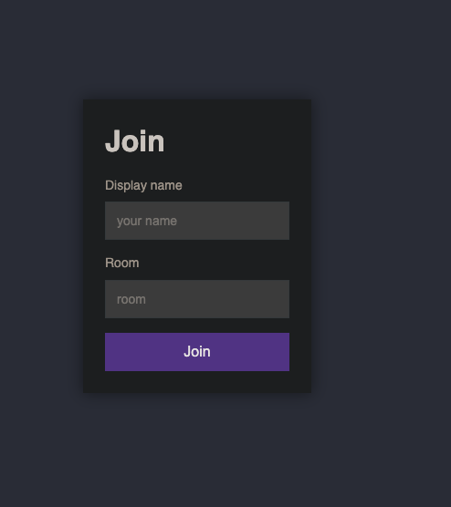
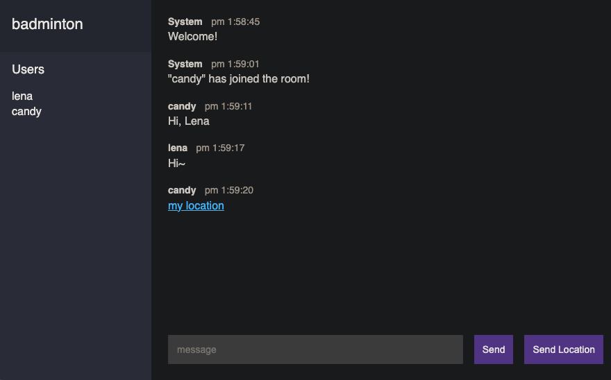

# Chat APP

Provide an online chat room where users can find like-minded people to chat with.

## Installation

To get started with this project, follow these steps:

1. Clone this repository to your local machine.
2. Navigate to the project directory.
3. Install dependencies by running `npm install`.
4. Start the application with `npm start`.

## Usage

Once the application is running, you can access it at `http://localhost:3000` in your web browser. From there, you can enter you name and room to start chatting. You can also send your geographical location to people in the room.

Here are some screenshots of the application in action:

## Technologies Used

- Node.js
- Express.js
- Socket.io
- Geolocation API

## License

This project is licensed under the [MIT License](LICENSE).
